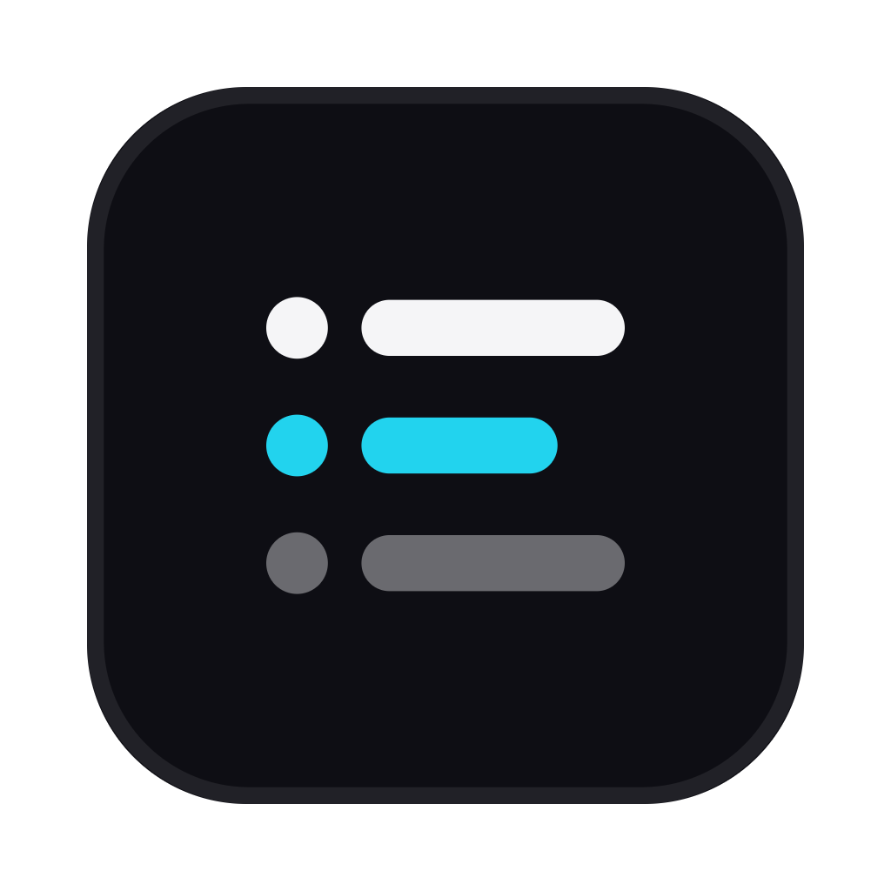

# Muster

<p align="center">
  
</p>

<p align="center">
  <strong>Next-gen IDE for parallel agentic development.</strong><br/>
  Run Claude Code, Codex, OpenCode, OMP, and other CLI agents side-by-side — each in its own worktree or folder workspace, tracked in one place.
</p>

<p align="center">
  
  
  <a href="https://github.com/jefrontv/muster/releases"></a>
</p>

**Repo:** [github.com/jefrontv/muster](https://github.com/jefrontv/muster)

---

## What it is

Muster is a desktop app for running coding agents in parallel across git worktrees and folder projects. It also ships team-oriented site workflows (LocalWP WordPress roots, Sites tooling, ActiveCollab bindings) on top of the agent IDE surface.

### Highlights

- **Parallel workspaces** — one agent per worktree/folder; compare results without thrashing a single checkout
- **Terminals** — multi-pane terminals with scrollback that survives restarts
- **Sites / LocalWP** — LocalWP site shells open on `app/public` as folder projects so terminals and the tree land on the WordPress root
- **Git + tasks** — GitHub/GitLab review flows, Linear/ActiveCollab-oriented task surfaces
- **SSH** — remote workspaces with reconnect and port forwarding
- **CLI** — `muster` / `orca` CLI for scripting worktrees, terminals, and browser actions from agents
- **Auto-update** — packaged builds check [GitHub Releases](https://github.com/jefrontv/muster/releases) for updates

### Supported agents

Any CLI agent that runs in a terminal. Commonly used with Claude Code, Codex, OpenCode, OMP, Cursor CLI, Copilot CLI, and others.

---

## Install

### Packaged desktop app

1. Grab a build from **[Releases](https://github.com/jefrontv/muster/releases)** (macOS arm64 is the primary CI artifact).
2. Open the app and install updates from **Check for updates** when new releases land.

Auto-update reads:

```text
https://github.com/jefrontv/muster/releases/latest/download/
```

(and the repo atom feed for prerelease/tag discovery).

### Develop from source

```bash
pnpm install
pnpm dev
```

Build a local macOS package:

```bash
pnpm run build:desktop
pnpm run build:computer-macos
pnpm run build:notification-status-macos
pnpm run ensure:electron-runtime
pnpm exec electron-builder --config config/electron-builder.config.cjs --mac --arm64 --dir
# → dist/mac-arm64/Muster.app
```

More detail: [CONTRIBUTING.md](.github/CONTRIBUTING.md).

---

## Releases

Bump the version in `package.json` and push it to `muster`:

```bash
npm version 1.14.10 --no-git-tag-version
git commit -am "chore: bump version to 1.14.10"
git push origin muster
```

That triggers [`.github/workflows/release.yml`](.github/workflows/release.yml), which builds macOS arm64, uploads electron-builder artifacts (`latest-mac.yml`, zip/dmg) to a draft release, and publishes it once typecheck passes. Publishing creates the `v1.14.10` tag; do not push the tag yourself.

Optional repo secrets for signed/notarized mac builds: `MAC_CERTS`, `MAC_CERTS_PASSWORD`, `APPLE_ID`, `APPLE_APP_SPECIFIC_PASSWORD`, `APPLE_TEAM_ID`.

---

## License

Muster is free and open source under the [MIT License](LICENSE).
