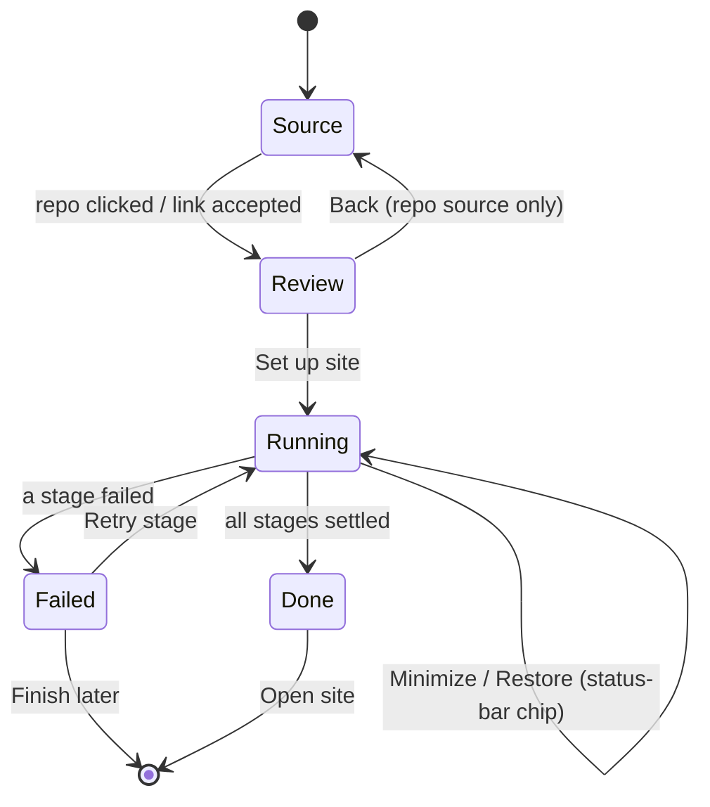
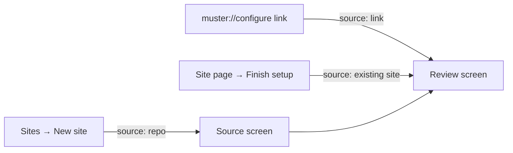
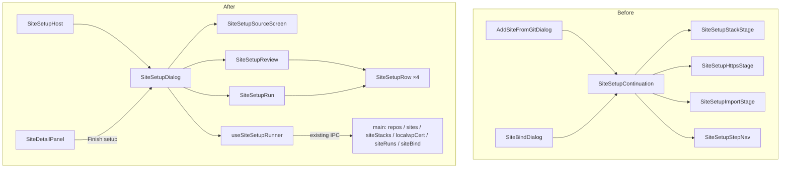
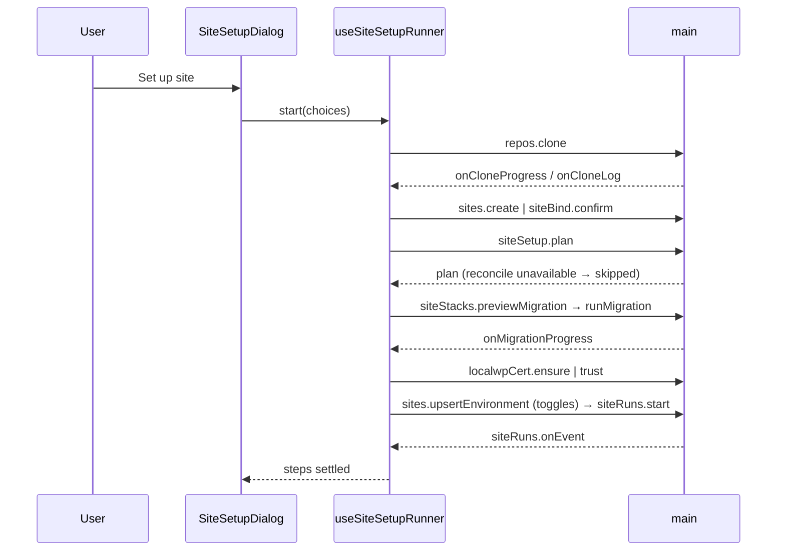

# Site setup redesign — one dialog, one review, one run

2026-09-04. Replaces the two entry dialogs (`AddSiteFromGitDialog`, `SiteBindDialog`) and the three-page stepper (`SiteSetupContinuation`) with a single `SiteSetupDialog`: pick a source, review one plan, press one button, watch one log.

## Why

Both flows end in the same `Site` record and the same three stages, but each asks the user to walk them one page at a time and confirm each one. The planner in main already knows the answers to almost every question the pages ask. Audit (2026-09-03) found:

| # | Friction | Evidence |
|---|---|---|
| 1 | Nine clicks, three confirm surfaces for one intent | `AddSiteFromGitDialog.tsx` steps `pick → confirm → cloning → setup`, then `SETUP_STEP_ORDER = ['stack','https','import']` (`SiteSetupStepNav.tsx:15`) |
| 2 | "Clone this repository?" restates a row the user just clicked; the path shown is not editable | `AddSiteFromGitDialog.tsx` confirm step |
| 3 | An abandoned setup cannot be resumed | `SiteSetupContinuation` is rendered only by the two dialogs; nothing on `SiteDetailPanel` re-enters it |
| 4 | Stack page swaps between four body/action copy variants for a binary choice | `site-setup-strings.ts` `stackBody`/`stackCreateBody`/`stackAgentLocalBody`/`stackAgentLocalCreateBody` |
| 5 | wp-admin credentials are hardcoded and never shown | `SiteSetupStackStage.tsx:36-37` |
| 6 | Bind dialog leads with a ten-row field table before the one real question (which folder) | `SiteBindDialog.tsx:391-394`, `getSiteBindFieldLabels` |
| 7 | Provider auth reasons are inert text | `AddSiteFromGitDialog.tsx` renders `activeProvider.reason` with no action |
| 8 | A rejected `muster://` link produces no UI | `index.ts:717` `console.warn` only |
| 9 | No projects root → native folder picker appears after "Clone repository" with no warning | `AddSiteFromGitDialog.tsx:217` |

## Design

### Principles

- **One consent point.** Nothing is written until "Set up site". Same contract the bind dialog has today, now for both sources.
- **Defaults are the plan.** Every row on the review is prefilled from the planner. The user edits only what they disagree with.
- **One run, one log.** Stages run in sequence in one screen. Each row reports its own result; a failed stage stops the run and leaves the site resumable.
- **Copy never overclaims** (STYLEGUIDE UX rules). Rows say "will clone", "will create" while pending; "cloned", "serving", "trusted" only after the call returns.

### Flow



Entry points into `Source`:



The link and the existing-site paths skip `Source`: the source is already decided.

### Screen 1 — Source (repo)

Only for "New site". The picker stays as it is today minus the confirm step, with two fixes: destination is visible and editable here, and provider auth reasons are actionable.

```
┌─────────────────────────────────────────────────────────────┐
│ New site                                              ⌄  ✕  │
│ Pick a repository. Nothing is cloned until you review.      │
│                                                             │
│ [ Bitbucket ] [ GitHub ]      Clone into  ~/Documents/Sites ✎│
│                                                             │
│ ┌ Search repositories ─────────────────────────────────── ┐ │
│ └──────────────────────────────────────────────────────── ┘ │
│  efront_au/clearvue                                         │
│  efront_au/avantage                                         │
│  efront_au/flex                                             │
│  efront_au/mbm-2026            Mortgage Broker Melbourne    │
│  …                                                          │
│                                                             │
│  Showing the 200 most recent. Search to find others.        │
│                                                             │
│                                                   [Cancel]  │
└─────────────────────────────────────────────────────────────┘
```

Unconfigured provider tab:

```
│ [ Bitbucket ] [ GitHub ]                                    │
│                                                             │
│   ⚠  GitHub is not connected.                               │
│      Run `gh auth login` in a terminal, then come back.     │
│                                    [Copy command]           │
│                                                             │
│   (Bitbucket variant:)                                      │
│   ⚠  Bitbucket is not connected.                            │
│                          [Open Settings → Integrations]     │
```

- Destination `✎` opens the native picker (`shell.pickDirectory`), and the chosen path persists for the session. With no root configured the field reads "Choose a folder" and is required before a row can be clicked. This replaces the surprise picker (friction 9).
- Clicking a row goes straight to Review (friction 2).

### Screen 2 — Review

The centre of the redesign. One screen, four rows, one primary button.

```
┌─────────────────────────────────────────────────────────────┐
│ Set up flex                                           ⌄  ✕  │
│ From efront_au/flex · Nothing is written until you continue │
│                                                             │
│  ⬇  Clone                                                   │
│     efront_au/flex → ~/Documents/Sites/flex        main     │
│                                                             │
│  ▣  Serve locally                            LocalWP  ✎     │
│     Create a LocalWP site at flex.local                     │
│                                                             │
│  🔒 HTTPS                                             ☑     │
│     Trust the certificate for flex.local                    │
│                                                             │
│  ⬇  Import from production                    tools@host ☑  │
│     ☑ Database   ☑ Files   ☑ Upload rewrite   ☑ Search-replace│
│                                                             │
│                              [Back]        [Set up site]    │
└─────────────────────────────────────────────────────────────┘
```

Row anatomy (all four share it):

```
  icon  Title                                 control
        one-line summary in muted text
```

| Row | Summary source | Control | When unavailable |
|---|---|---|---|
| Clone | repo full name, destination, branch | none on repo source; on link source the folder picker (below) | hidden when an existing checkout is chosen |
| Serve locally | `plan.stack`: `stack`, `suggestedDomain`, `alreadyLocalWp`, `hasWordPress` | `✎` opens a Popover: stack ToggleGroup (only when `alternatives.length > 0`), domain Input | greyed row with `plan.stack.reason` (e.g. off macOS) |
| HTTPS | `localwpCert.status` for the chosen domain | Checkbox, default on when `supported` | greyed with `cert.reason`; hidden when Serve is off |
| Import | `plan.import`: `environment`, `blockedBy`, `confirmable` | Checkbox for the row; four inline toggles bound to `SITE_IMPORT_TOGGLES` | greyed with the run planner's reason; `confirmable` shows the branch/environment mismatch inline with an "Import anyway" checkbox |

Serve popover:

```
┌──────────────────────────────────┐
│ Local stack                      │
│ [ LocalWP ] [ Agent Local ]      │
│                                  │
│ Domain                           │
│ ┌ flex.local ──────────────────┐ │
│ └──────────────────────────────┘ │
│ Agent Local needs a WordPress    │
│ install in the folder; this      │
│ repo has none yet.               │
└──────────────────────────────────┘
```

The helper line is `plan.stack.reason` when a choice is ruled out. Selecting the ruled-out stack is disabled, not hidden, so the user learns why.

Review for a **link** source replaces the Clone row with a target row and puts the link's field table behind a disclosure:

```
│  📁 Folder                                                  │
│     ○ ~/Documents/Sites/flex            (existing checkout) │
│     ● Clone efront_au/flex into ~/Documents/Sites/flex      │
│     ○ Choose another folder…                                │
│                                                             │
│  🔑 Credentials                                             │
│     tools@tools.efront.dev:/home/tools/flex · main          │
│     The link carries an SSH password; it is stored in your  │
│     OS keychain and never shown again.                      │
│     ▸ All fields from the link (10)                         │
```

Existing checkouts come from `pending.candidates` (only `exists === true`), pre-selected when there is exactly one. The disclosure holds the ten-row `BindSummary` table unchanged.

Review for an **existing site** ("Finish setup") shows only the rows the planner reports as not done, with the Clone row absent.

### Screen 3 — Running

Same rows, now reporting. The primary button becomes the minimize affordance's sibling; Cancel is per stage where a cancel exists.

```
┌─────────────────────────────────────────────────────────────┐
│ Setting up flex                                       ⌄     │
│                                                             │
│  ✓  Cloned                                        12.4 MB   │
│  ◐  Creating LocalWP site at flex.local      Provisioning…  │
│     ▸ Log                                                   │
│  ·  HTTPS                                                   │
│  ·  Import from production                                  │
│                                                             │
│  ██████████████████░░░░░░░░░░░░░░░░░░░░░░░░░░░░  2 of 4     │
│                                                             │
│  The dialog can be minimised; the work carries on.          │
│                                             [Minimize]      │
└─────────────────────────────────────────────────────────────┘
```

States per row: `·` pending, `◐` running (spinner), `✓` done, `–` skipped (with reason), `✕` failed.

- Clone: progress bar from `repos.onCloneProgress`, log from `repos.onCloneLog`, Cancel via `repos.cloneAbort`.
- Serve: log from `siteStacks.onMigrationProgress`. No cancel exists in main; the row says "Can't be cancelled while running" while active.
- HTTPS: `localwpCert.ensure` (or `trust` if the cert exists). May prompt the OS for a password; row says so while running, matching the existing `osPassword` hint.
- Import: `siteRuns.start`, log from `siteRuns.onEvent`, Cancel via `siteRuns.cancel(runId)`.

Escape and outside-click are refused throughout Running (existing `refuseOutside` pattern). The X is hidden; Minimize is the only way out. The status-bar chip (`useMinimizedSiteSetup`) reads the current row title as its stage.

### Screen 4 — Done

```
┌─────────────────────────────────────────────────────────────┐
│ flex is ready                                            ✕  │
│                                                             │
│  ✓  Cloned into ~/Documents/Sites/flex                      │
│  ✓  Serving at https://flex.local                           │
│  ✓  Certificate trusted                                     │
│  ✓  Imported database and files from tools@host             │
│                                                             │
│  wp-admin    hello@efront.com.au / admin      [Copy]        │
│  Local-only account created by LocalWP.                     │
│                                                             │
│                        [Close]      [Open flex.local]       │
└─────────────────────────────────────────────────────────────┘
```

Credentials appear only when the Serve stage created a LocalWP install (friction 5). Skipped rows read "– HTTPS skipped" with the reason.

### Screen 5 — Failed

```
│  ✓  Cloned                                                  │
│  ✕  Serve locally                                           │
│     LocalWP refused the domain: flex.local is already taken │
│     ▸ Log                                                   │
│  –  HTTPS          not run                                  │
│  –  Import         not run                                  │
│                                                             │
│                   [Finish later]      [Change and retry]    │
```

"Change and retry" returns to Review with the completed rows locked and the failed row editable. "Finish later" closes; the site now exists, so the Finish-setup banner takes over.

### Site page — Finish setup banner

Inserted in `SiteDetailPanel` directly after `<header>` (before "Local environment"), only when `siteSetup.plan` reports the `stack` stage as `active` or `blocked`, or the cert for `localDomain` is untrusted.

```
┌─────────────────────────────────────────────────────────────┐
│ ⚠  Setup isn't finished                                      │
│    Nothing is serving this folder locally.   [Finish setup] │
└─────────────────────────────────────────────────────────────┘
```

Opens `SiteSetupDialog` with `source: { kind: 'site', siteId }`. Persistent inline status, not a toast (STYLEGUIDE: "Persistent inline status → inline text + Badge").

### Status-bar chip

Unchanged component (`SiteSetupStatusSegment`). Stage strings become the row titles: "Cloning", "Creating LocalWP site", "Trusting certificate", "Importing". "Needs a decision" appears only on Review and Failed.

### Rejected link

Main emits `siteBind:rejected { reason }` on the renderer channel alongside the existing `REQUEST_EVENT_CHANNEL`; the renderer toasts `toast.error('Link not accepted', { description: reason })`. The URL is never included (it can carry a password).

## Architecture



### Runner

`useSiteSetupRunner(choices)` is a renderer hook: a sequential state machine over `['clone','register','serve','https','import']`, each step a thin wrapper over the calls the stage components make today (table in the API appendix). It exposes `{ steps, start, retry, cancelCurrent, log }`. No new main-process orchestration: main already exposes every operation, and keeping the sequence in the renderer keeps minimize/restore trivial (the hook lives in the always-mounted host).

`register` is the consent write: `sites.create` for a repo source, `siteBind.confirm` for a link source, nothing for an existing site. After `register`, the runner calls `siteSetup.plan({ siteId })` once and reconciles: a stage the fresh plan marks `unavailable` is recorded as skipped with its reason rather than attempted. This is what lets Review show a plan before a checkout exists.



### Pre-checkout plan

Review needs a proposed domain before any site exists. The derivation is already a pure function of a name: `defaultLocalDomain(name)` in `src/main/sites/site-bind-url.ts:158` (used by `site-setup-plan.ts:143` as `site.localDomain.trim() || defaultLocalDomain(path.basename(site.path))`). Move it to `src/shared/site-local-domain.ts` and call it from both main and the renderer with the repo slug (repo source) or the link's `localDomain`/`reponame` (link source). Stack availability comes from `siteStacks.available()`; cert support from `localwpCert.status({ domain })`; import defaults are "all four on" exactly as `SiteSetupImportStage` seeds today.

## Steps

Each step is independently shippable and keeps the app working. Steps 1–3 are additive; step 4 is the cutover; step 5 deletes.

### 1. Shared foundations

Files: `src/shared/site-local-domain.ts` (new; `defaultLocalDomain` moved from `src/main/sites/site-bind-url.ts:158`, callers in `site-bind-url.ts` and `site-setup-plan.ts:143` re-pointed), `src/shared/site-setup-defaults.ts` (new; `LOCALWP_ADMIN_EMAIL`/`PASSWORD` moved from `SiteSetupStackStage.tsx:36-37`), `src/main/ipc/site-bind.ts` + `src/shared/site-bind-types.ts` + `src/preload` (add `onRejected` event; emit from `handleSiteBindUrl` failure path in `src/main/index.ts:714-735`).

Verify: existing `site-setup-plan` tests still pass with the extracted helper; new unit test for the domain helper (slug → domain, link domain wins); IPC test that a rejected URL emits `rejected` with the reason and without the URL.

### 2. Review and Run components (no wiring yet)

Files (all new under `src/renderer/src/components/sites/`): `SiteSetupRow.tsx`, `SiteSetupReview.tsx`, `SiteSetupServePopover.tsx`, `SiteSetupRun.tsx`, `SiteSetupDone.tsx`, `use-site-setup-runner.ts`, `site-setup-review-strings.ts`.

Runner step bodies are lifted from: clone (`AddSiteFromGitDialog.tsx:222-249`, `SiteBindDialog.tsx:204-256`), serve (`SiteSetupStackStage.tsx:179-250`, including the double-envelope `.ok` check its header documents), https (`SiteSetupContinuation.tsx:177-199`), import (`SiteSetupImportStage.tsx:79-184`).

Verify: runner unit tests with mocked `window.api`: happy path runs five steps in order; a failed serve leaves https/import `not-run` and exposes `retry`; a plan marking stack `unavailable` records `skipped` with the reason and never calls `runMigration`; cancel during clone calls `cloneAbort`; cancel during import calls `siteRuns.cancel(runId)`. Review render tests: rows reflect plan fields; Serve popover disables a ruled-out stack with the reason; Import row shows the mismatch checkbox only when `confirmable`.

### 3. Dialog shell and source screens

Files: `SiteSetupDialog.tsx` (new; `source: { kind: 'repo' } | { kind: 'link', pending } | { kind: 'site', siteId }`), `SiteSetupSourceScreen.tsx` (new; picker lifted from `AddSiteFromGitDialog.tsx` pick step, with destination field and provider action buttons), `SiteSetupLinkTargetRow.tsx` (new; candidates radio + disclosure holding the existing `BindSummary`), `SiteSetupHost.tsx` (mount the one dialog; open on `setNewSiteDialogOpen` or on `usePendingSiteBind().pending`).

Provider actions: Bitbucket → the existing settings navigation to Integrations (find the store action used by Settings nav); GitHub → clipboard copy of `gh auth login` with a "Copied" toast. Launching a terminal is out of scope.

Verify: port `AddSiteFromGitDialog.search.test.tsx` and `.minimize.test.tsx` to the new dialog; new tests: clicking a row moves to Review with the destination shown; no root → row click is refused until a destination is chosen; link source with one existing candidate preselects it; link source with none preselects Clone.

### 4. Cutover

Files: `App.tsx:2708-2711` (remove `SiteBindDialog`; `SiteSetupHost` alone), `SitesPage.tsx:237-240` (unchanged flag), `SiteDetailPanel.tsx` (banner after `<header>`, before Local environment), `StatusBar`/`SiteSetupStatusSegment` stage strings.

Verify (live, dev app): New site → click repo → Set up site → Done for a small repo; minimize during clone, navigate, restore; open a `muster://configure` link with an existing checkout, with no checkout (clone path), and a malformed one (toast); close after clone fails on serve → site page shows Finish setup → completes. Escape/outside-click refused during Running; free on Source and Review.

### 5. Delete the old flow

Remove: `AddSiteFromGitDialog.tsx` (+ its tests), `SiteBindDialog.tsx` (+ tests), `SiteSetupContinuation.tsx`, `SiteSetupStepNav.tsx`, `SiteSetupStackStage.tsx`, `SiteSetupHttpsStage.tsx`, `SiteSetupImportStage.tsx`, `SiteCloneStep.tsx` if unreferenced, the now-unused entries in `site-setup-strings.ts`, `site-bind-strings.ts`, `site-clone-source-strings.ts`. Keep `BindSummary`, `SiteBindTargetPicker` only if the link target row reuses them; otherwise delete.

Verify: `pnpm run typecheck:node && pnpm run typecheck:web`, oxlint, `check-max-lines-ratchet`, full `src/renderer/src/components/sites` + `src/main/sites` vitest. `grep -rn "SiteSetupContinuation\|AddSiteFromGitDialog\|SiteBindDialog" src` returns nothing.

## Risks and open questions

- **Pre-checkout domain differs from post-checkout.** The renderer derives from the repo slug; main derives from `path.basename(site.path)`. For `repos.clone` the folder name IS the slug, so they agree; the reconcile step re-reads the plan after register regardless.
- **Pre-checkout plan can be wrong.** Review says "Create a LocalWP site" before the clone reveals whether the folder holds WordPress. Mitigated by the post-register reconcile: the Run screen reports "skipped: reason" instead of failing. Copy on Review uses "will" phrasing to stay honest.
- **Serve has no cancel.** Same as today; the row states it. Not adding cancellation to the migration in this plan.
- **Bind consent.** The link flow's "nothing written until confirm" contract moves from a dedicated button ("Bind this site") to "Set up site". The description line on Review states it explicitly for the link source.
- **Existing-site Finish setup relies on `siteSetup.plan` on every detail-panel mount.** One IPC call per selection; acceptable, but if it proves slow on SSH-backed sites, gate it behind `localStack === 'plain'` first.
- **Minimize chip labels change** ("Confirm the link" → "Needs a decision" etc.). Update `site-setup-minimize.test.ts` expectations.
- Open: should Review auto-start the clone when the user is idle on it? Decided no — one consent point is simpler to reason about and to test.
