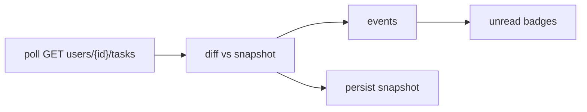

# ActiveCollab × Muster — Integration Design

Status: **design agreed, phase 1 in progress**
Author: recon from `active-collab-mcp` (Python), `active-collab-notifications` (Swift/CollabBar), and a full
trace of Muster's existing Jira provider.

## Goal

ActiveCollab becomes a first-class Muster task provider: assigned tasks appear in the existing Tasks
page, are writable (comment, complete, labels, due, assignee), an ActiveCollab project can be bound
to a Muster sidebar project, and the ActiveCollab MCP can be installed into the user's agents in one
click so the agent and the human share the same task context.

## Why this is not "add a fifth enum member"

Three facts from recon set the shape of the work.

1. **Every provider operation exists four times.** The store calls a runtime client, which dispatches
   either to `window.api.
` (local) or to a runtime RPC method (remote host). So each operation
   needs: IPC handler, preload bridge, RPC method, `OrcaRuntimeService` method. Jira has 19
   operations, hence 76 touch points before any UI.
2. **`TaskPage.tsx` is 12,429 lines** and holds ~40 provider-specific sites (toolbar, sub-toolbar,
   list, detail, empty state, resume effects, availability notices).
3. **`config/max-lines-baseline.txt` is a shrink-only ratchet** (`.ts` 300 / `.tsx` 400 code lines).
   Jira's `issues.ts` (850), `client.ts` (554), `store/slices/jira.ts` (618) and
   `JiraIssueWorkspace.tsx` (800) are all grandfathered. **Copying Jira's layout fails `pnpm lint`.**
   ActiveCollab must be split into small modules from the start.

## The ActiveCollab API, as it actually behaves

Both reference implementations independently hit the same walls. These are load-bearing.

| Reality | Consequence for us |
| --- | --- |
| Auth is `POST {base}/api/v1/issue-token`, form-encoded `username`/`password`/`client_name`/`client_vendor`, returning a long-lived opaque token | No refresh flow. 401/403 ⇒ "needs reconnect", pause polling |
| Header is `X-Angie-AuthApiToken: <token>` — no `Bearer` | — |
| Bad credentials return **HTTP 500**, not 401 | Error mapping cannot assume 401 means "wrong password" |
| **No incremental/changes API.** No ETag, no `?since=`, no webhooks | Poll `GET users/{id}/tasks` and diff against a persisted snapshot |
| Collections hard-cap at **100 per page**; `?page=N` is the only control; totals arrive in `X-Angie-Pagination*` **headers** | Must read response headers. A `limit` param is a lie |
| Server-side filtering on tasks is **not implemented** | Filter client-side. Do not trust `assignee_id`/`completed` query params |
| `/tasks/{id}/comments` **500s on the efront instance** | Read comments from the inline array on `GET projects/{p}/tasks/{t}`; the dedicated endpoint is a fallback only |
| Timestamps are **epoch ints on read, `"YYYY-MM-DD"` strings on write** | Bidirectional codec, not a single Date type |
| `due_on` is UTC midnight | Re-anchor to the local calendar or every due date is off by one for AU users |
| `0` is the null sentinel for `assignee_id`, `task_list_id`, `job_type_id`, `label_id` | `0` is not "user 0" |
| Labels read as objects, write as **name strings**, and a write **replaces the whole set** | Round-trip needs normalisation; partial label updates must merge client-side |
| Clearing a field needs an explicit `null`, not omission | — |
| Attachment `download_url` embeds a literal `--DOWNLOAD-TOKEN--` sentinel | Substituting it puts the token in a URL — redact before logging |
| `whoami` shape varies across builds | Prefer `GET /user-session` → `logged_user_id`; fall back to `/users` + email match |
| No 429 handling exists in either reference | We add `Retry-After` support rather than inherit the gap |

**Cloud ActiveCollab (`app.activecollab.com/<id>`) is out of scope for phase 1.** It needs a two-step
`issue-token-intent` exchange that neither reference implements. The target instance
(`projects.efront.com.au`) is self-hosted.

## Freshness model

There is no cheap incremental fetch, so we mirror CollabBar's proven design:

Snapshot is `{ taskId: { commentsCount, updatedOn, lastDueBucket } }`, keyed by **string** (JSON
flattens integer-keyed maps). Rules learned the hard way:

- **First run emits zero events** — otherwise installing the integration fires a notification storm.
- **Never diff against a failed or partial fetch**, or recovery fabricates a wave of "new task".
- **After any local write, re-poll silently and clear the resulting flag**, or the diff reports the
  user's own action back to them.
- Comment deltas carry no authorship, so a changed `comments_count` needs one detail fetch to
  exclude the user's own comments. Fail open.

## Phasing

Phase 1 is the foundation everything else needs, and is independently useful (tasks visible).

| Phase | Scope | State |
| --- | --- | --- |
| 1 | Shared enum + every silent-miss site, settings migration flag, main AC client (auth, tasks, comments), credential store, IPC + preload + RPC, tests | in progress |
| 2 | Renderer: source registry, connect dialog, integration card, task list, detail workspace, TaskPage wiring | not started |
| 3 | Writes: comment, complete/reopen, labels, due, assignee | not started |
| 4 | Bind an AC project to a Muster sidebar project | not started |
| 5 | One-click MCP install into agents | not started |

## Phase 1 traps (each is a silent failure)

1. **`isTaskProviderAvailable` (`task-providers.ts:89-108`) is an if/else chain ending in
   `return availability.linearConnected`.** A new member with no branch is silently gated on Linear.
   No tsc error, no lint error. This is the single highest-risk edit in the change.
2. **`TaskProvider` is declared twice** — `task-providers.ts:1` (canonical) and
   `task-source-context.ts:12` (local, avoids a cycle). Update only the first and
   `normalizeTaskProvider` returns `null`, silently dropping the task-source context at runtime.
3. **`visibleTaskProvidersDefaultedForJira` cannot be reused.** `persistence.ts:3160` stamps it true
   on every load, so every existing profile already has it — the append branch would never fire and
   no existing user would ever see ActiveCollab. A new flag is required.
4. **Four hardcoded `z.enum` copies** (`ipc/repos.ts:741`, `automations.ts:63,71`,
   `folder-workspace.ts:8`) reject unknown providers at the validation boundary with no type error.
5. **`mobile/` declares a third `TaskProvider`** that excludes Jira, and has its own `tsc`. Widening
   the shared union leaks the new member in via `Exclude<…, 'jira'>`.

`lint:switch-exhaustiveness` is an ally: it catches `providerIdentityCachePart`,
`shouldHideTaskPageListChrome`, `getTaskSourceContextSummary`, `getProviderIdentityLabel`, and the
automation switches. Run `pnpm tc` after the enum change and let the errors enumerate the rest.

## What we deliberately do not copy from Jira

Multi-site fan-out (`siteId` threaded through all 19 ops, `selectSite`, the site picker) — an
ActiveCollab token addresses exactly one instance, and dropping this removes ~19 optional parameters.
Also out: ADF conversion, the REST v2/v3 split, the XSRF User-Agent hack, JQL, workflow transition
graphs, and required-custom-field discovery. ActiveCollab has a fixed task schema and
open/completed + task lists instead of transitions.

## MCP one-click install

`install.sh` in `active-collab-mcp` **writes no agent configuration** — it only prints instructions.
Muster must write each agent's config itself:

| Agent | File | Shape |
| --- | --- | --- |
| Claude Code | `~/.claude.json` → `mcpServers.activecollab` | `{ type: 'stdio', command: 'activecollab-mcp', args: ['--stdio'], env: {} }` |
| Codex | `~/.codex/config.toml` → `[mcp_servers.activecollab]` | `command` = **absolute path**, `args = ["--stdio"]` |
| Cursor | `~/.cursor/mcp.json` | `{ url: 'http://127.0.0.1:8787/mcp' }` (needs the daemon) |

The server reads its own credentials from `~/.activecollab-mcp/credentials.json`, so a one-click
install should offer to seed that file from the token Muster already holds — that is what makes the
agent and the human share one task context.
