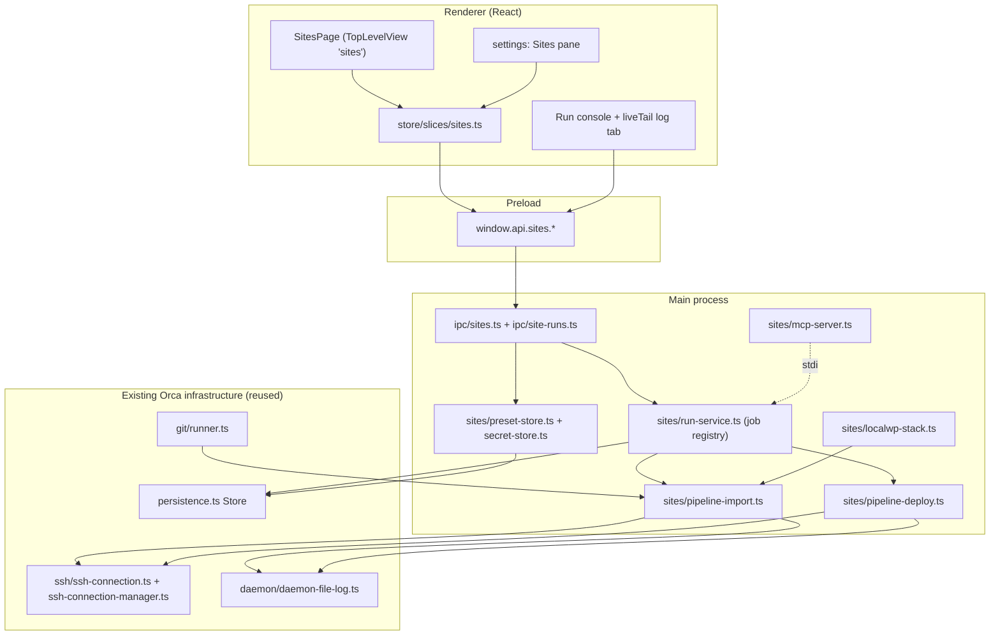

# Muster — Orca × ocsites Integration Plan

**Repo:** `muster-ui` (fork of `stablyai/orca` @ `v1.4.156-rc.1-19-gd8e0f112c`, remote renamed `upstream`, work branch `muster`)
**Absorbing:** `ocsites` (`~/Documents/Sites/ocsites`, Python, 16.5k LOC, `bitbucket.org/efront_au/ocsites`)
**Status:** approved 2026-07-25 — implementation in progress
**Date:** 2026-07-25

---

## 1. Thesis

Orca orchestrates coding agents across git worktrees. ocsites orchestrates WordPress site operations (import/deploy over SSH) across a folder of client sites. Both are keyed on *"a local checkout of a client project."* Today they are two tools with two pickers, two configs, two mental models.

**Muster = one app.** Pick a client site, open it with agents in worktrees, and import/deploy it — same window, same entity, same credentials store. The ocsites CLI, curses TUI, `pipx` install, LaunchAgent, and AppleScript URL-handler app all disappear.

**Non-goal:** keeping the ocsites Python package alive inside Muster. No sidecar, no subprocess, no `ocsites … --json` contract. The engine is ported to TypeScript and runs in Muster's main process.

---

## 2. Architecture decisions

| # | Decision | Rationale | Rejected alternative |
|---|---|---|---|
| **D1** | **Port the ocsites engine to TypeScript** in `src/main/sites/`. No Python at runtime. | Every heavy dep has a first-class Node equivalent, and `ssh2@^1.17.0` is **already a production dependency** of Orca with a mature wrapper (`src/main/ssh/ssh-connection.ts:119`). The real port is ~3.2k lines, not 16.5k (see §3). | **Python sidecar.** ocsites needs `paramiko` + `mysql-connector-python` + `cryptography` (native wheels) → PyInstaller onedir, ~60–90 MB × 3 platforms × 2 arches, every embedded `.dylib` individually codesigned inside `afterPack`, and a `verifyLinuxGlibcFloor` fight (`config/electron-builder.config.cjs:139-141`). `forceCodeSigning` makes a macOS release fail hard on any miss. Orca's only Python precedent (`native/computer-use-linux/runtime.py`) is a *dependency-free* single script, Linux-only, with a hand-written PowerShell twin for Windows. |
| **D2** | **A `Site` is a sidecar record cross-referenced to an existing `Repo`**, not a new entity kind and not new fields on `Repo`. | `Repo` (`src/shared/types.ts:237`) has zero extensible metadata and is consumed by 251 KB `WorktreeList.tsx` + 88 KB `worktree-remote.ts`. House precedent for third-party per-repo state is a keyed sidecar on `PersistedState` — `sparsePresetsByRepo` (`src/shared/types.ts:3461`, written by `Store.saveSparsePreset` `src/main/persistence.ts:4662`). ocsites' preset key `local_target_directory` maps 1:1 onto `Repo.path`. | **New `WorkspaceScope` kind.** 68 non-test `type === 'folder'` branch sites + PTY/session/runtime-RPC partitioning, all so a site can host agent terminals — which its git repo *already* does correctly. Wrong axis. |
| **D3** | **Runs are a main-process job service**, not PTY panes. | A deploy is an orchestration of ssh/mysqldump/npm/sftp steps, not one subprocess. A PTY would force re-serializing structured stage+percent data into ANSI and re-parsing it, while inheriting `src/main/ipc/pty.ts` (5697 lines, ~15 coupled Maps) for an entity that is not a worktree. Template already exists: `src/main/ipc/workspace-space.ts:14-56` (in-flight registry + 100 ms-throttled progress + `AbortController`). | **Terminal pane as source of truth.** Automations chose panes only because the payload *is* an interactive agent TUI. |
| **D4** | **Secrets in per-secret `safeStorage` files**, not in `orca-data.json`. | `orca-data.json` is one debounced blob with a hand-maintained encrypt allowlist (`src/main/persistence.ts:3604-3627`) — 201 sites × N envs × 2 secret kinds would bloat it, and any missed allowlist entry ships cleartext. Use `writeSecureFile` (`src/shared/secure-file.ts:86-114`) + the versioned envelope from `src/main/orca-profiles/profile-cloud-session-store.ts:109-117`, read via `readStoredCredentialToken` (`src/main/integration-credential-file.ts:29-45`). | Fernet + a sibling `secret.key` (ocsites' scheme) — strictly weaker; the safeStorage key lives in the OS keychain. Fernet decrypt is implemented **once**, for the importer only. |
| **D5** | **Primary UI = a new `TopLevelView` "Sites" page**, run logs = `readOnly + liveTail` editor tabs. | `TopLevelView` is a cheap, exhaustively-checked seam (`src/shared/top-level-view.ts:5`). The `readOnly+liveTail` `OpenFile` contract (`src/renderer/src/store/slices/editor.ts:261-264`) already gives a Monaco-hosted, Find-capable, session-persisted, tailing log viewer — template `src/renderer/src/components/right-sidebar/ai-vault-session-log-open.ts:62-147`. | Adding a `TabContentType` for the log (~15 files: TabBar, tab groups, floating panel, drag activation). |
| **D6** | **Muster ships a built-in MCP server** exposing the site tools to agents, auto-registered into agent MCP configs. | Orca already writes MCP config for agents (`src/shared/mcp-config.ts`). This replaces `ocsites-mcp` + its LaunchAgent, and is the feature that only a merged app can have: the agent working in the worktree can deploy the site it is editing. | Keeping `ocsites-mcp` as an external daemon — reintroduces the Python runtime we just removed. |
| **D7** | **One-way import from `~/.config/ocsites/`**, never write back. | Dual-writing two stores invites divergence and corruption. Import is re-runnable; ocsites keeps working off its own files until decommissioned. | Shared config files as a live contract. |
| **D8** | **Fork hygiene lands before any feature work.** | Four hardcoded upstream URLs in `src/main/updater.ts` (`:1105`, `:1462`) + `src/main/updater-prerelease-feed.ts:5-13` + `config/dev-app-update.yml` will pull `stablyai/orca` DMGs over the build and overwrite the installed app. | — |

---

## 3. ocsites inventory and disposition

| Module | LOC | Disposition |
|---|---:|---|
| `cli.py` | 2943 | **Delete.** Picker/clone/settings TUIs + updater. Replaced by Muster UI + Orca's updater. |
| `tui_deploy.py` | 3195 | **Delete UI, port constants.** Keep `DEPLOYMENT_IMPORT_TOGGLES` / `DEPLOYMENT_DEPLOY_TOGGLES` / env-resolution / git-status logic (~350 lines). |
| `tui_common.py` | 777 | **Delete.** curses colour pairs. |
| `mcp_server.py` | 4399 | **Split.** ~40 % is the job system + impl helpers → port into `src/main/sites/`. ~60 % is thin tool wrappers → become IPC handlers + Muster's MCP tool definitions. |
| `deploy/backup.py` | 942 | **Port.** The import/deploy orchestrator. Core of Phases 3–4. |
| `deploy/create_localwp.py` | 582 | **Port.** LocalWP GraphQL/socket integration (macOS-gated). Phase 6. |
| `bitbucket.py` | 467 | **Mostly delete.** Orca has `src/main/bitbucket/client.ts` + `repos:clone`. Port only workspace repo listing + stored App Password auth. |
| `scan.py` | 375 | **Mostly delete.** Replaced by `scanNestedRepos` (`src/main/project-groups/nested-repo-discovery.ts:209`) + Orca's repo list. |
| `deploy/config.py` | 275 | **Port as schema only.** Field/env key lists survive; Fernet + JSON file replaced by `Store` + `safeStorage`. |
| `deploy/run_history.py` | 232 | **Port.** Maps onto `createDaemonFileLog` (`src/main/daemon/daemon-file-log.ts:44`) + `HistoryManager`-style per-run dirs (`src/main/daemon/history-manager.ts:66-100`). |
| `deploy/database.py` | 222 | **Port.** `mysqldump`/import/active-theme. Needs `mysql2`. |
| `deploy/server.py` | 215 | **Port.** cache clear, git pull, theme build+upload. |
| `deploy/bedrock.py` | 160 | **Port.** Remote layout detection (`web/` + `web/app`). |
| `config.py` | 149 | **Port as schema.** `sites_roots`, favourites, web tool → Muster settings. |
| `url_handler.py` | 146 | **Delete.** Replaced by Electron `setAsDefaultProtocolClient`. |
| `deploy/utils.py`, `local_db_backup.py`, `roots.py`, `models.py`, `node_version.py`, `ssh_util.py`, `cert_trust.py` | ~600 | **Port** (small, mechanical). |
| `json_cli.py`, `herd.py` | 819 | **Delete.** These were the herdr-era CLI contract — obsolete once the engine is in-process. |
| `install.sh`, `shell/ocsites.zsh` | ~500 | **Delete.** Replaced by the app installer. |

**Net port surface: ~3,200 lines of business logic.** ~7,900 lines of curses UI and ~1,300 lines of CLI/installer scaffolding are deleted outright.

### External binaries the engine still shells out to

| Binary | Used for | Availability strategy |
|---|---|---|
| `mysql` / `mysqldump` (local) | DB import; resolved from PATH + `/opt/homebrew/opt/mysql/bin`, `/Applications/MAMP/Library/bin` (`deploy/database.py:29-50`) | Port `resolveMysqlBinary()`; surface a "not found" health check |
| `wp` (WP-CLI) | `wp search-replace`, plugin/theme queries | Optional; disable the toggle when absent |
| `npm` + `nvm` | Theme build, pinned via `engines.node` (`node_version.py:18`) → `. ~/.nvm/nvm.sh && nvm use <v> && <cmd>` (`deploy/server.py:122-131`) | Port as-is; bash-only path, gate on non-Windows |
| `zip` / `unzip` | Local dist zip + remote extraction | Remote side is server-side (`find -prune \| zip -@`); local side should move to a Node zip lib (see §8 deps) |
| `git` | branch/remote/status | Use Orca's `src/main/git/runner.ts` (WSL cwd translation + Windows `.cmd` shims for free) |
| `open` / `pgrep` | LocalWP app control | macOS-only, already gated |

---

## 4. Target architecture



**Boundaries.** The renderer never touches SSH, MySQL, or secrets. `run-service.ts` owns the job registry and is the only thing that emits progress. Pipelines are pure staged functions taking `{ signal, onProgress, onLog }` — unit-testable without Electron.

---

## 5. Data model

New fields on `PersistedState` (`src/shared/types.ts`), defaults in `src/shared/constants.ts:403`. No migration needed — `Store.load()` is `{ ...defaults, ...parsed }` (`src/main/persistence.ts:3081`).

```ts
// src/shared/site-types.ts
type Site = {
  id: string                    // uuid
  repoId: string                // FK → Repo.id; the site IS a repo
  displayName: string
  localWpRoot: string           // '' | 'app/public' (LocalWP)
  localDomain: string           // acme.local
  dbUser: string
  dbSocket: string              // LocalWP per-site socket; '' → 127.0.0.1 TCP
  dbPort: number | null
  phpVersion: string
  stack: 'mamp' | 'localwp' | 'plain'
  activeEnvironment: string
  environments: Record<string, SiteEnvironment>
  notes: string
}

type SiteEnvironment = {
  hostname: string
  username: string
  rootPath: string              // default 'public_html'
  liveDomain: string
  liveDomainProtocol: 'http' | 'https'
  deployCommand: string
  themeDistPath: string
  // import toggles
  exportDatabase: boolean
  exportFiles: boolean
  wpSearchReplace: boolean
  wpUploadRewrite: boolean
  // deploy toggles
  gitPullOnServer: boolean
  clearServerCache: boolean
  deployThemes: boolean
}
```

Secrets (`SSH password`, `DB password`) are **not** in this type. They live at
`<userData>/site-secrets/<base64url(siteId:env:kind)>.enc`, written with `writeSecureFile` + `{version:1, format:'electron-safe-storage-v1', savedAt, ciphertext}`. The UI only ever sees a `passwordsSet: { ssh: boolean; db: boolean }` flag — same posture as ocsites' MCP server.

**Environment resolution** (ported from `tui_deploy.resolve_env_for_branch`) becomes *better* in Muster: Orca already tracks a branch per worktree, so a deploy initiated from a worktree resolves its env from that worktree's branch, not the repo's checked-out HEAD.

```
branch name matches an env name → that env
no match, 'main' env exists      → 'main'
no match, no 'main'              → first env
```

**Safety guard (ported verbatim):** when the branch matches no environment and no explicit env is supplied, a run is **blocked** and returns the env it *would* have used plus a dry-run preview. Overridable only by an explicit env or an explicit confirm. In the UI the confirm is `useConfirmationDialog()` (`src/renderer/src/components/confirmation-dialog.tsx`) with `confirmVariant: 'destructive'`.

---

## 6. Migration from ocsites

Live data on this machine: **201 presets, 29 with multiple environments**, `~/.config/ocsites/deploy_presets.json` (264 KB), `secret.key` = 44 bytes (standard base64 Fernet key).

`src/main/sites/ocsites-config-import.ts` (one-shot, re-runnable, read-only against the source):

1. Read `~/.config/ocsites/config.json` → `sites_roots` (`['~/Documents/Sites', '/Volumes/devcenter-repos']`), `web_tool`, `favorites`, Bitbucket username/App Password.
2. For each `sites_root`, run the **existing** `scanNestedRepos` (`src/main/project-groups/nested-repo-discovery.ts:209`) + `createNestedProjectGroupResolver` (`nested-repo-import.ts:140`) → a `ProjectGroup` tree with `createdFrom: 'folder-scan'`. This *is* the ocsites site picker, already built and budgeted.
3. Read `deploy_presets.json → connection_presets[]`. Match each `local_target_directory` to a `Repo.path` via `normalizeRuntimePathForComparison`. Unmatched presets are reported, not silently dropped.
4. Fernet-decrypt `password` / `db_password` with `secret.key`. **~50 lines of `node:crypto`** — Fernet is `AES-128-CBC` + `HMAC-SHA256` over a base64url token, key split 16/16. Used only here.
5. Re-encrypt each secret via `safeStorage` into `site-secrets/`. Write the non-secret `Site` records into `orca-data.json`.
6. Emit an import report: sites matched / unmatched / secrets migrated / decrypt failures.

`~/.config/ocsites/` is **never modified**. ocsites keeps working until it is decommissioned in Phase 11.

---

## 7. Phases

Each phase ends with a demonstrable behaviour. Effort is one developer.

### Phase 0 — Fork hygiene (blocking) · ~2 days

| Task | Files |
|---|---|
| Kill the updater | hard-return at `src/main/updater.ts:1435`; repoint `:1105`, `:1462`; `src/main/updater-prerelease-feed.ts:5-13`; `config/dev-app-update.yml`; `publish` block `config/electron-builder.config.cjs:404-409` |
| Kill telemetry | `TELEMETRY_ENABLED = false` at `src/main/telemetry/client.ts:22` (note `config/scripts/verify-telemetry-constants.mjs` greps that exact shape). Already fails closed without CI-injected keys. |
| App identity | `appId: 'au.com.efront.muster'`, `productName: 'Muster'` (`config/electron-builder.config.cjs:54-55`); `BASE_APP_NAME` / `BASE_APP_USER_MODEL_ID` (`src/main/startup/dev-instance-identity.ts:5-6`); dev userData `'muster-dev'` (`src/main/startup/configure-process.ts:171`); `package.json` `name`/`bin`; `resources/darwin/bin/orca` hardcodes `Contents/MacOS/Orca` and **breaks the moment `productName` changes** |
| Home dir | `~/.orca` → `~/.muster`, 38 files (`src/main/hooks.ts:93 ORCA_DIR`, `linear/client.ts:79`, `jira/client.ts:93`, `speech/openai-api-key-store.ts:14`, `keybindings/keybinding-file.ts:26`, `agent-hooks/installer-utils.ts:104`, …). Required to coexist with a real Orca install. |
| Register `muster://` | add a `protocols` key to the builder config + `app.setAsDefaultProtocolClient` (Orca registers **no** OS protocol today) |
| Disable CI | delete/gate `release-cut.yml`, `release-mac-build.yml`, `homebrew-bump.yml`, `readme-downloads-badge.yml`, `track-community-prs.yaml`, `issue-os-labeler.yaml`, `pullfrog.yml`, `mobile-*-release.yml`, and the four `push`-triggered e2e workflows |
| Leave alone | the `ORCA_*` env prefix (5421 occurrences, internal wire format), `orca://pair` (mobile pairing payload, not an OS scheme), UI copy strings (cosmetic, Phase 11) |

**Exit:** `pnpm dev` runs a Muster-branded app, `pnpm lint` + `pnpm test` pass, no network call reaches `stablyai/orca`, a second install does not collide with Orca's user data.

**Do not change `app.setName` again after this phase** — it rotates the macOS Keychain item (`"<appName> Safe Storage"`) and invalidates every `safeStorage` secret.

### Phase 1 — Sites foundation · ~1 week

Types (`src/shared/site-types.ts`, `site-identity.ts`), `PersistedState` fields + defaults, `Store` methods modelled on `saveSparsePreset` (`persistence.ts:4662`), `preset-store.ts`, `secret-store.ts`, the Fernet importer, `src/main/ipc/sites.ts` (`sites:list|link|unlink|scanRoots`, `sitePresets:get|save|delete`), preload + `api-types.ts`, `store/slices/sites.ts`, and a read-only `SitesPage`.

**Exit:** all 201 presets imported and listed in-app with correct env names; secrets decrypt-round-trip; ocsites untouched on disk.

### Phase 2 — Run engine · ~1 week

Two primitives must be **built, not borrowed** — both are prerequisites for correct cancellation:

1. `src/main/lib/stream-command.ts` — generalise `gitStreamStdout` (`src/main/git/runner.ts:962-1075`): per-stream `StringDecoder`, byte backstop, abort → tree kill, `onStdout` early-stop.
2. `src/main/lib/kill-command-tree.ts` — `killSpawnedCommandTree` degrades to a bare `child.kill()` on POSIX (`src/main/git/runner.ts:315-318`), which **orphans `ssh`/`rsync`/`mysqldump` grandchildren**. Spawn `detached: true` and `process.kill(-pid, …)`; `terminateWindowsProcessTree` (`src/main/windows-process-tree-kill.ts:12`) on win32.

Then `run-service.ts` (registry + 100 ms-throttled progress, copying `src/main/ipc/workspace-space.ts:42-62`), `run-log.ts` over `createDaemonFileLog`, `ipc/site-runs.ts`, the run console, and the `readOnly+liveTail` log tab opener.

**Exit:** a fake 60-second staged job streams to the UI, survives panel remount (last progress + log tail re-served from main), cancels cleanly with zero orphaned processes, persists its log, and fires a completion notification.

### Phase 3 — Import pipeline (server → local) · ~1.5 weeks

Ported stage-for-stage from `deploy/backup.py:446-536`:

| Stage | Source | Notes |
|---|---|---|
| Ensure LocalWP site running | `backup.py:419` | Phase 6 stub until then |
| Local MySQL connectivity check | `backup.py:396` | `mysql2` with `socketPath` |
| SSH connect + remote layout resolve | `backup.py:344` + `deploy/bedrock.py` | via `SshConnectionManager` |
| Extract remote DB creds from `wp-config.php` | `database.py:51` | |
| `mysqldump \| gzip` with a 0600 remote option file | `backup.py:590-610` | creds never in argv; `set -o pipefail` so a truncated dump fails loudly |
| SFTP download with byte progress | `backup.py:611-622` | **gap:** no byte-level progress exists in `src/main/ssh/` — add `onProgress` to `src/main/ssh/sftp-upload.ts:11-25` |
| Empty-dump guard, local import, cleanup | `backup.py:625-646` | |
| `base.zip` + `wp-content.zip` via `find -prune \| zip -@` | `backup.py:115-135`, `:648-710` | prunes `uploads`/`cache`/`themes` so multi-GB dirs are never walked |
| WP upload rewrite + `.htaccess` external-redirect strip | `backup.py:731-812` | `_strip_external_redirects` prevents an imported prod `.htaccess` 301-ing localhost back to production |
| `wp search-replace` live ↔ local | `backup.py:813` | 600 s default timeout |

**Exit:** a real client site imports end-to-end and matches an ocsites-produced import byte-for-byte in DB row count and file tree.

### Phase 4 — Deploy pipeline (local → server) · ~1 week

Theme build with nvm-pinned node (`server.py:96-140`), auto `npm ci` when `node_modules` is missing, dist zip, SFTP upload with progress, remote `unzip` + `chmod 755/644`, `git pull` on server, cache clear.

**Exit:** a real theme deploys; a build failure surfaces the last 20 lines of output and aborts before any upload.

### Phase 5 — Environments and safety · ~4 days

Env CRUD (create/rename/duplicate/delete), branch → env resolution driven by the *worktree's* branch, the blocked-run guard, and `preview`/dry-run.

**Exit:** deploying from a `staging` worktree targets staging with no manual switch; an unmatched branch blocks with a preview instead of running.

### Phase 6 — Local stacks · ~1 week (macOS-gated)

Port `create_localwp.py`: Local app detection (`pgrep -x Local`), GraphQL endpoint discovery, per-site socket resolution + readiness wait, `ensure_site_running`/`stop_site`, and the plain-site → LocalWP migration. MAMP/DBngin remains the TCP path.

**Exit:** a stopped LocalWP site auto-starts before an import; migrate-to-LocalWP moves a plain site into `app/public` and rewires the socket.

### Phase 7 — Bitbucket + new site · ~4 days

Extend `src/main/bitbucket/client.ts` (env-var auth only today, `:41-53`) with a stored App Password + workspace repo listing, feed Orca's existing `repos:clone` (`src/main/ipc/repos.ts:2151`) which already streams clone progress, then bind a `Site` record to the new repo.

**Exit:** "+ New Site" browses the Bitbucket workspace, clones into a sites root, and lands on the deploy-config form.

### Phase 8 — Agent surface (MCP) · ~5 days

`src/main/sites/mcp-server.ts` exposing the ported tool set over stdio, auto-registered into agent MCP configs via `src/shared/mcp-config.ts`. Same safety model: passwords never returned or settable; writes require an explicit env or confirm.

**Exit:** a Claude agent inside a Muster worktree runs `get_deployment_config` → `set_deployment_toggles` → `run_deploy_functions` against the site it is editing.

### Phase 9 — `muster://` protocol · ~2 days

`setAsDefaultProtocolClient('muster')` + `open-url` / `second-instance` handling → a bind dialog that resolves the target folder, derives the local domain from `live-domain` (`acme.com.au` → `acme.local`), stores credentials, and opens the site. Accepts the legacy `ocsites://` shape and parameter aliases so existing dashboard links keep working.

**Exit:** clicking a dashboard link focuses Muster and opens the bind dialog. The AppleScript handler app is deleted.

### Phase 10 — Utility tools + run history · ~1 week

`sync_uploads_from_remote`, `sync_uploads_subdir_from_remote`, `sync_plugin_from_remote`, `compare_plugins`, `run_wp_cli` / `run_remote_wp_cli` (block/allow-list preserved), `test_connection`, `check_health`, `find_file`, `fetch_remote_paths`, plus the run-history browser with jump-to-first-error.

**Exit:** every ocsites MCP tool has a Muster equivalent (see §10 parity list).

### Phase 11 — Decommission · ~3 days

Parity sign-off, migration doc, UI copy pass (~900 `Orca` strings + 5 i18n catalogs), `ocsites` marked EOL, LaunchAgent + shell wrapper + `pipx` package removed from the dev machine.

**Total: ~9–11 weeks.** Usable internally after Phase 4 (~5 weeks).

---

## 8. New dependencies

| Package | Why | Notes |
|---|---|---|
| `mysql2` | Local MySQL connectivity check + active-theme query (`deploy/database.py:199`, `backup.py:396`). No MySQL client exists in the repo. | Pure JS (no native build), supports `socketPath` for LocalWP sockets |
| a zip reader (`yauzl` or `unzipper`) | Local extraction of `base.zip` / `wp-content.zip`. Nothing in the lockfile — `tar@7` is a devDep transitive only. | Alternative: keep shelling `unzip`, matching `src/main/ssh/system-ssh-file-transfer.ts:49-56`'s `tar` idiom. Decide in Phase 3. |

Adding a runtime dep is a **three-place change**: `package.json` dependencies, `PACKAGED_RUNTIME_PACKAGE_ROOTS` (`config/packaged-runtime-node-modules.cjs:16-32`), and `pnpm.onlyBuiltDependencies` if it has a postinstall. `verifyPackagedMainRuntimeDeps` (`:198-243`) only scans `out/main/index.js` — a bare `require()` that lands in a rollup chunk escapes the check and fails **only in the packaged app**.

---

## 9. Constraints that shape the code

These are non-negotiable repo gates, not style preferences.

- **`max-lines`: 300 for `.ts`, 400 for `.tsx`, 800 for tests** (`.oxlintrc.json:80-101`), and `config/scripts/check-max-lines-ratchet.mjs:128` **fails on any newly added bypass** — `config/max-lines-baseline.txt` may only shrink. `AGENTS.md:12` forbids it outright. Existing extension points (`preload/index.ts`, `api-types.ts`, `persistence.ts`, `App.tsx`, `Settings.tsx`) are grandfathered, so *editing* them is free; every **new** sites file must be split. Plan `src/main/sites/` as ~20 narrow modules from the start.
- **Localization is a lint gate.** `config/scripts/audit-localization-coverage.mjs` flags any user-visible literal (JSX text, `title`/`label`/`placeholder`/`aria-label`, `toast.*` args, `keywords:`) not inside `translate()`; the allowlist is ~7 entries. `verify-localization-catalog.mjs:268-289` requires exact key parity across en/es/ja/ko/zh (13,834 lines each) *and* matching `{{placeholder}}` sets. Workflow: `pnpm sync:localization-catalog` → `pnpm repair:locale-catalog`.
- **`no-top-level-translate.test.ts` is a hard CI gate.** Any module-scope `translate()` under `src/renderer/src` fails it — wrap every string table in `createLocalizedCatalog(() => [...])`.
- **Styled-scrollbar gate** (`check-styled-scrollbars.mjs`, in `pr.yml`): any `overflow-auto`/`overflow-y-auto` class literal must carry `scrollbar-sleek`/`scrollbar-editor`/`worktree-sidebar-scrollbar` in the *same* literal. A site list and a log panel both trip this.
- **`typescript/switch-exhaustiveness-check` is type-aware** over main+preload+shared+renderer. Every new union member surfaces every switch that must handle it.
- **No `interface`** (`consistent-type-definitions: ['error','type']`), no `any`, `node:` protocol imports, no `helpers`/`utils`/`common` filenames.
- **`removeHandler` before `handle`** in every IPC registration (`src/main/ipc/repos.ts:1097-1142`) — macOS window re-creation re-enters registration.
- **Redact before crossing the bridge.** Deploy logs carry SSH hosts, DB names, and can carry passwords. Copy `redactEphemeralVmRecipeDiagnosticText` (`src/main/ipc/ephemeral-vm.ts:126`). Mandatory, not optional.
- **Cross-platform.** LocalWP/MAMP and the nvm build path are macOS-first; gate them explicitly rather than faking Windows support. Paths via `path.join`, equality via `normalizeRuntimePathForComparison`.
- **`AGENTS.md` §SSH Use Case** — a Muster workspace may itself live on a remote host. v1 scope: sites are **local-only**; the remote-runtime path (`src/main/runtime/rpc/methods/*`, zod-validated) is an explicit non-goal, gated in the UI rather than silently broken.

---

## 10. Parity checklist

All 44 ocsites MCP tools must have a Muster equivalent (IPC and/or MCP) before ocsites is decommissioned.

**Discover** — `list_sites` · `find_sites` · `workspace_overview` · `get_deployment_status` · `get_deployment_config` · `list_deployment_toggles` · `get_git_status` · `get_wordpress_version` · `get_active_theme` · `get_remote_active_theme`
**Configure** — `set_deployment_toggles` · `set_deployment_fields`
**Environments** — `list_environments` · `create_environment` · `rename_environment` · `delete_environment` · `duplicate_environment` · `get_resolved_environment` · `which_env_for_branch`
**Run** — `preview_run` · `run_import_functions` · `run_deploy_functions` · `run_wp_cli` · `run_remote_wp_cli` · `test_connection` · `check_health` · `compare_plugins` · `find_file`
**Sync** — `sync_uploads_from_remote` (+`start_`) · `sync_uploads_subdir_from_remote` (+`start_`) · `sync_plugin_from_remote` (+`start_`) · `fetch_remote_paths` (+`start_`)
**Jobs/history** — `list_jobs` · `get_job_status` · `get_job_result` · `cancel_job` · `list_recent_runs` · `get_run_log`
**URL** — `generate_bind_url` · `parse_bind_url`

TUI features that must also survive: fuzzy site search, favourites, multi-root support with `RootLabel/name` qualification, live log with jump-to-first-error, mid-run cancel, per-run log retention (30 days / 200 runs per site), and the branch-mismatch deploy guard.

---

## 11. Risks

| Risk | Severity | Mitigation |
|---|---|---|
| Updater pulls upstream Orca over the fork | **critical** | Phase 0, before anything else. Verify with a packaged build and a network trace. |
| `app.setName` change after secrets exist rotates the keychain key | high | Fix identity in Phase 0 and never touch it. Documented at the top of `secret-store.ts`. |
| POSIX tree-kill gap orphans `ssh`/`mysqldump` on cancel | high | Build `kill-command-tree.ts` in Phase 2 *before* any pipeline code; assert no orphans in the Phase 2 exit test. |
| Deploy against the wrong environment | high | Port the blocked-run guard verbatim; `useConfirmationDialog` with `destructive` variant; env shown in the run header and the log preamble. |
| `max-lines` cap discovered late forces a rewrite | medium | Decompose `src/main/sites/` up front (~20 modules); run `pnpm lint` per phase, not per release. |
| Two config stores diverge during transition | medium | One-way import only (D7); re-import is idempotent; ocsites declared read-only for Muster users from Phase 1. |
| Upstream Orca drift makes rebasing painful | medium | Keep sites code in **new files**; touch existing files with minimal additive hunks (the 8 known touch points); rebase onto upstream **tags**, not `master`. Tripwire: if a phase requires editing `src/main/pty/`, `src/main/runtime/`, or `persistence.ts` beyond adding `Store` methods, the seam is wrong. |
| **SSH host-key policy is weaker than ocsites** | **closed** | Was: Orca accepted any host key and only recorded its SHA256 fingerprint, so site runs sent a stored SSH password with no MITM protection. Now closed app-wide: `src/main/ssh/known-hosts-store.ts` implements TOFU pinning keyed by host+port, consulted from the single ssh2 `hostVerifier` in `ssh-connection.ts` (`doSsh2Connect`). Existing `~/.ssh/known_hosts` entries (including hashed and `@revoked`) are honored read-only; Muster's own pins live in `userData/ssh-known-hosts.json`. A changed key is refused with both fingerprints named. The system-ssh fallback transport shells out to the OpenSSH binary and keeps OpenSSH's own verification. |
| `ssh2` is slower than paramiko for large SFTP | low | `cpu-features` is deliberately unbuilt (`config/scripts/rebuild-native-deps.mjs:63-67`) so `ssh2` uses pure-JS crypto. Measure on a real `wp-content.zip`; fall back to shelling `scp`/`rsync` for bulk transfers if needed (precedent: `system-ssh-file-transfer.ts:49-56`). |
| Windows support for the WP pipelines | low | Explicitly out of scope for v1; gate the Sites page on darwin/linux. |

---

## 12. Open questions

1. **Bitbucket repo for the fork** — name, workspace, and whether upstream Orca history is pushed or squashed. (Repo stays local until decided.)
2. **AGPL/MIT** — Orca is MIT, so a private fork is unconstrained. Confirm nothing else in the tree carries a copyleft licence before distributing.
3. **Sites in the left sidebar?** v1 keeps the Sites list on its own page. `FolderWorkspaceRow` (`src/renderer/src/components/sidebar/worktree-list-groups.ts:128`, emitted `:1440`) is the template if inline site rows are later wanted — a ~26-site additive change, cleanly separable.
4. **Zip strategy** — Node lib vs shelling `unzip`. Decide in Phase 3 against a real multi-GB `wp-content.zip`.
5. **Multi-user** — is Muster ever installed for another developer, or is this single-operator? Affects whether the Bitbucket App Password and sites roots need an onboarding flow (Phase 7) or can stay import-only.
6. **Mobile companion parity** — Orca's mobile app talks to `src/main/runtime/rpc/methods/*`. Should deploy status be visible on mobile? If yes, add a `defineStreamingMethod` (`src/main/runtime/rpc/core.ts:122`) in Phase 10; if no, skip the runtime-RPC seam entirely.

---

## 13. Resolved decisions (post-review)

The plan was approved with "proceed with all phases; use best judgment on the open questions." Those calls, made and recorded here rather than left implicit:

| Q | Decision | Reasoning |
|---|---|---|
| 12.1 Fork repo | Stays local. `origin` renamed to `upstream`; work happens on branch `muster`; **no push remote configured**. Bitbucket remote added when the workspace/repo name is chosen. | User instruction. Prevents an accidental push to `stablyai/orca`. |
| 12.2 Licence | Orca is MIT (`LICENSE`); a private fork carries no copyleft obligation. No further action. | Verified in-tree. |
| 12.3 Sites in left sidebar | **No** for v1. Sites live on their own `TopLevelView` page. `FolderWorkspaceRow` remains the template if this is revisited. | Keeps the 26-site sidebar row union untouched; cleanly separable later. |
| 12.4 Zip strategy | **No zip library.** Shell out to the system `zip`/`unzip` through the Phase-2 streaming-exec primitive, matching Orca's existing `tar`-shelling idiom (`src/main/ssh/system-ssh-file-transfer.ts:49-56`). A startup health check reports a missing binary. | Both binaries ship with macOS and every mainstream Linux; the remote side already shells `find -prune \| zip -@`. Avoids a dependency, an asar-unpack entry, and a `PACKAGED_RUNTIME_PACKAGE_ROOTS` edit for something the OS already provides. `mysql2` remains the one new runtime dep. |
| 12.5 Multi-user | Single-operator assumption. The ocsites importer is the primary setup path; a manual "add site" form is the fallback. No onboarding wizard. | 201 presets already exist locally; a wizard serves a user who does not exist yet. |
| 12.6 Mobile parity | **Out of scope.** No `src/main/runtime/rpc/methods/*` registration, so the mobile RPC allowlist test is never engaged. | Deploy is a desk activity; the runtime-RPC seam is a second zod-validated surface for no current benefit. |

### Deviation from §7 Phase 0: `~/.orca` is retained

The plan called for renaming `~/.orca` → `~/.muster`. **Not done, deliberately.** Measured surface: 37 production references across 31 files plus 169 test references, including the managed-command matcher regexes (`isClaudeManagedCommand`) that Orca uses to find and clean up its own agent hooks.

`~/.orca` is not app state — it is the shared agent-hooks and integration-credential directory (`agent-hooks/*.sh`, `linear-tokens/`, `jira-tokens/`, the OpenAI key store, keybindings). The isolation that actually matters is already achieved by the identity rename: `appId`, `productName`, the `userData` directory, and the macOS `safeStorage` Keychain item are all Muster-owned, so app state, secrets, and settings never collide with an Orca install.

Renaming the directory would instead cost the user their existing Linear/Jira/OpenAI credentials and install a *second* set of agent hooks alongside Orca's, doubling hook fan-out to two relays. Revisit only if Muster and Orca must run side by side with independent agent hooks.

### As-built notes

- The native helper bundle name (`orca-notification-status`) is unchanged. It is an internal helper binary built from Swift sources, not user-facing identity; renaming it means editing the SwiftPM package plus two build scripts for no behavioural gain.
- The `ORCA_*` environment-variable prefix (5421 occurrences) is unchanged, per §7 — it is the app ↔ CLI ↔ relay ↔ hooks wire contract.
- Upstream CI is parked in `.github/workflows-upstream-disabled/` (22 workflows) rather than deleted; only `pr.yml` stays active. See the README in that directory.
- `Casks/` (Homebrew publishing) was removed — a private fork does not publish a cask, and `auto_updates true` pointed at upstream releases.

---

## 14. Implementation status

Phases 0–6 are implemented and verified. Phases 7–11 are not started.

| Phase | Status | Evidence |
|---|---|---|
| 0 Fork hygiene | done | Auto-update routed through `src/main/updater-release-feed-source.ts` and disabled; telemetry hard switch off; identity is `Muster` / `au.com.efront.muster`; CLI shims renamed; `muster://` + legacy `ocsites://` declared and registered; 22 upstream workflows parked. The running app uses `~/Library/Application Support/muster-dev`, isolated from `orca-dev`. |
| 1 Foundation | done | `sites` on `PersistedState`, `Store` site methods, safeStorage secret store, Fernet importer, `sites:*` IPC, zustand slice, Sites `TopLevelView` page. |
| 2 Run engine | done | `streamCommand` + POSIX process-group `killCommandTree`, run log with 30-day/200-run retention, throttled job registry, `siteRuns:*` IPC, run console with live tail and cancel. |
| 3 Import pipeline | done | SSH session over Orca's `SshConnection`, byte-progress SFTP, Bedrock-aware layout, `mysqldump \| gzip` under `set -o pipefail`, prune-based archive pull, zip-slip-guarded extract, upload rewrite + `.htaccess` redirect strip, search-replace. |
| 4 Deploy pipeline | done | nvm-pinned theme build with auto-install, dist zip + SFTP upload, remote swap with permissions, git pull, cache clear. |
| 5 Environments & safety | done | Environment CRUD with secrets moved on rename; `buildSiteRunPlan` / `canStartRun` implement `preview_run` and the accidental-prod-deploy guard; the UI confirms through `useConfirmationDialog`. |
| 6 Local stacks | done | 9 LocalWP modules (detection, WP-CLI env, site control, creation, DB export, app/public, migration plan + execute) behind `siteStacks:*`, macOS-gated. Smoke-tested against the real Local app (45 registered sites). |
| 7 Bitbucket | done | Workspace repo listing with pagination and SSH-preferred clone URLs, App Password in its own `safeStorage` file, credentials auto-seeded from the legacy ocsites config. Cloning drives Orca's existing `repos:clone` rather than shelling git. |
| 8 Agent MCP | done | Built-in `muster-sites` MCP server, **24 ocsites-named tools** over hand-rolled stdio JSON-RPC (no SDK dependency added). Every write routes through `buildSiteRunPlan`/`canStartRun`; passwords are structurally unreachable. `site` may be omitted and is resolved from the agent's cwd — the merged-app payoff: the agent editing the theme deploys that site. |
| 9 `muster://` bind flow | done | Parse/generate with every ocsites parameter alias, `acme.com.au` → `acme.local` derivation, `open-url` + `second-instance` + cold-start argv intake, a link stages a request that only an explicit user confirm applies. The AppleScript handler app is gone. |
| 10 Utility tools | done | `sync_uploads_*`, `sync_plugin`, `compare_plugins`, `fetch_remote_paths`, `run_wp_cli`/`run_remote_wp_cli` with the read-safety allowlist, `test_connection`/`check_health` with classified failures, `find_file`, WordPress version and active theme both sides, plus the run-history browser with jump-to-first-error. |
| 11 Decommission | not started | ocsites remains installed. Nothing in Muster reads it at runtime — only the one-shot importer does — so decommissioning is a user decision, not a code change. |

### Verification performed

- **Migration, against the real 201-preset ocsites config**: importing in the running app produced **154 sites** (201 presets collapse to 154 unique local paths), **459 secrets** Fernet-decrypted and re-encrypted into the OS keychain, **0 failures**, 101 paths correctly reported as not on disk. No Python involved.
- **Fernet**: decrypts fixtures generated by the Python `cryptography` library that ocsites itself uses, including the double-base64 wrapping `ConfigManager.encrypt_password` applies.
- **Cancellation**: a spawned shell's grandchild is verified dead after abort, with a control test asserting a bare `child.kill()` leaves it alive — so the assertion cannot rot into a tautology.
- **Silent-corruption guard**: a truncated `.gz` piped into a stub `mysql` exits 0 without `set -o pipefail` and 1 with it, proving the flag guards the real bug.
- **Real binaries**: `find -prune | zip -@` verified to prune `uploads`/`.git`; real `unzip` verified to overwrite a mode-0444 file.
- **UI**: the Sites page renders all 154 sites with stack badges, branches and environment counts; the detail panel shows the branch-mismatch confirmation warning, both toggle groups, presence-only secret state, and Import/Deploy controls with step counts.
- **Two-layer write safety, exercised live against a real imported site.** `wp db drop --yes` with no opt-in returned `blocked: true` from the WP-CLI allowlist. The *same* command with `allowWrites: true` was still refused — this time by the environment guard: *"the checked-out branch does not match an environment — confirm the target explicitly."* A read-safe `wp core version` ran and exited 0. The opt-in flag cannot bypass the branch guard, which is exactly ocsites' model.
- **Full IPC surface live in the running app**: seven domains, 45 methods — `sites` (11), `siteRuns` (6), `siteStacks` (6), `siteTools` (11), `siteBind` (5), `siteBitbucket` (3), `siteMcp` (3). The MCP server reports 24 tools under the name `muster-sites`. Bitbucket credentials were auto-seeded from the legacy ocsites config with no user action.
- **Test suite**: `pnpm test` finished at **36,865 passing / 82 failing** against a **170-failing baseline** measured on the unmodified fork before any work — failures went *down* while ~1,260 tests were added. The remaining 82 are pre-existing load-sensitive failures in files this work never touched, verified per-file against the changed-file set with a JSON reporter run. This feature's own 951 tests pass 951/951.
- **44/44 ocsites MCP tools covered**, verified by a script that parses `@mcp.tool()` out of `mcp_server.py`, maps each name to its Muster surface, and asserts every claimed IPC channel actually exists in `src/main/ipc/site*.ts`. Zero unmapped tools, zero claimed-but-absent channels. Two intentional consolidations: `get_job_result` folds into `get_job_status` (in Muster `job_id == run_id`, and the result is the persisted log), and each `start_*` async variant folds into its base tool because every Muster sync is already a cancellable background run.
- **Gates**: `pnpm typecheck` (node + cli + web) clean; `oxlint` 0 errors; max-lines ratchet clean with **no new bypasses**; styled-scrollbar and reliability-gate checks pass; localization catalog and coverage pass across all five locales.

### Deliberate divergences from ocsites

1. **Bedrock theme deploy is fixed.** `server.py` hardcoded `wp-content` for the *remote* theme path, so deploying a Bedrock site uploaded the theme to a directory WordPress never reads. The remote path now derives from the resolved layout (`<webroot>/app/…`). Covered by tests for both Bedrock shapes.
2. **Import step order corrected in the shared contract.** The toggle list claimed pipeline order but listed search-replace before upload-rewrite; the pipeline always ran upload-rewrite first. The array now matches execution.
3. **`clear_server_cache` and `pull_latest_changes` reuse the run's SSH session** instead of dialling a fresh connection each (Python opened three connections per deploy for two one-line commands).
4. **Non-interactive SSH password auth now also answers `keyboard-interactive`**, which most cPanel/Plesk hosts offer instead of `password`. paramiko did this automatically; ssh2 does not.
5. **Secrets are OS-keychain-backed** (`safeStorage`) rather than Fernet with the key in a sibling file, and are never returned across IPC.
